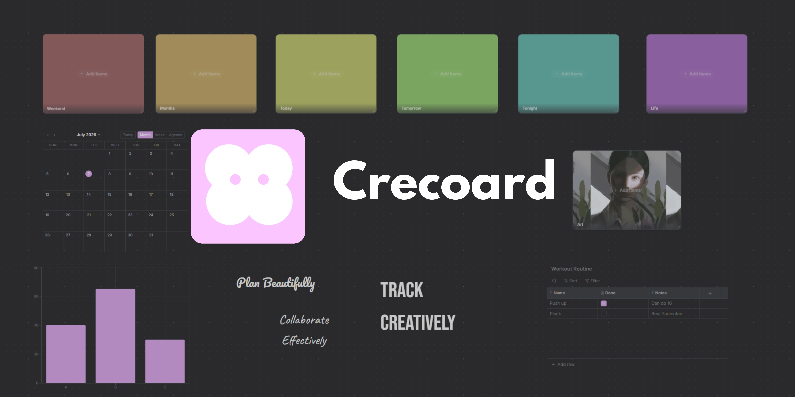

<p align="center">
  <a href="https://crecoard.com">
    
  </a>
</p>

# Crecoard

**A collaborative visual workspace — an infinite board canvas where you build your workflow out of drag-and-drop blocks, custom widgets, and shared spaces.**


> **Live:** [crecoard.com](https://crecoard.com)

<!-- Add 2–3 screenshots or a short GIF here — this is the first thing a reviewer looks at. -->
<!--  -->

## Roadmap

- [ ] Clean up UI
- [ ] Notification enhancements
- [ ] Port over to MacOS
- [ ] Correctly and fully implement community item implementations
- [ ] Mobile app
- [ ] Widget collections


## Tech stack

| Layer | Tools |
| --- | --- |
| Web | Next.js 16, React 19, TypeScript, Tailwind CSS, Zustand |
| Database | Supabase |
| Desktop | Electron, electron-builder, electron-updater |
| Tooling | Turborepo, npm workspaces |


---

## Running locally

Requires **Node 20+** and a free [Supabase](https://supabase.com) project.

```bash
npm install

# Configure the web app
cp apps/web/.env.example apps/web/.env.local
# → fill in your Supabase URL + anon key (and any optional service keys)

# Apply the database schema to your Supabase project
# (run the files in supabase/migrations/ in order via the Supabase SQL editor)

npm run dev        # starts the web app via Turborepo
```

Other scripts: `npm run build`, `npm run lint`, `npm run type-check`.

---

## License

[MIT](LICENSE) © Jintian Wu
