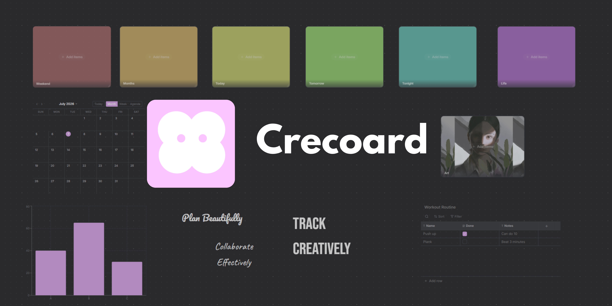

<p align="center">
  <a href="https://crecoard.com">
    
  </a>
</p>

# Crecoard

**A collaborative visual workspace — an infinite board canvas where you build your workflow out of drag-and-drop blocks, custom widgets, and shared spaces.**


> **Live:** [crecoard.com](https://crecoard.com)

## Sample Boards and Features


## Roadmap

- [ ] Notifications 
- [ ] Fully implement community item implementations
- [ ] Mobile app
- [ ] Widget collections
- [ ] MacOS suport


## Tech stack

| Layer | Tools |
| --- | --- |
| Web | Next.js 16, React 19, TypeScript, Tailwind CSS, Zustand |
| Database | Supabase |
| Desktop | Electron, electron-builder, electron-updater |
| Tooling | Turborepo, npm workspaces |


---

## Running locally

Requires **Node 20+**. The easiest path runs Supabase locally in Docker; a free hosted project works too.

### Option A — local Supabase (recommended)

Requires [Docker](https://www.docker.com/).

```bash
npm install
npx supabase start   # boots local Supabase + applies supabase/migrations/
npm run setup        # writes apps/web/.env.local from the running stack
npm run dev          # http://localhost:3000
```

A confirmed test account is seeded (see `supabase/seed.sql`): `test@crecoard.local` / `password123`. Re-apply the schema from scratch any time with `npx supabase db reset`.

### Option B — hosted Supabase

1. Create a free project at [supabase.com](https://supabase.com).
2. Apply the schema: run each file in `supabase/migrations/` **in order** in the SQL editor (or `supabase db push` if you link the project).
3. `cp apps/web/.env.example apps/web/.env.local`, then paste your Project URL + anon key (Settings → API) into the two `NEXT_PUBLIC_SUPABASE_*` vars.

Other scripts: `npm run build`, `npm run lint`, `npm run type-check`.

---

## License

[MIT](LICENSE) © Jintian Wu
